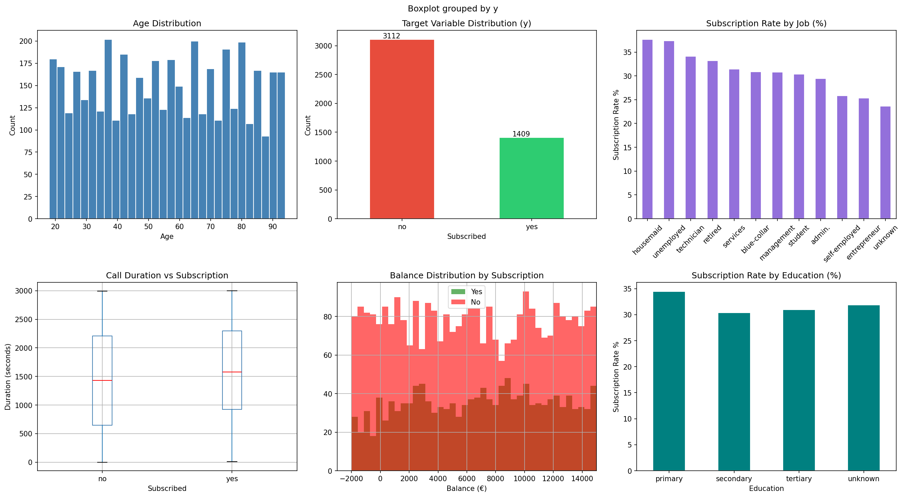
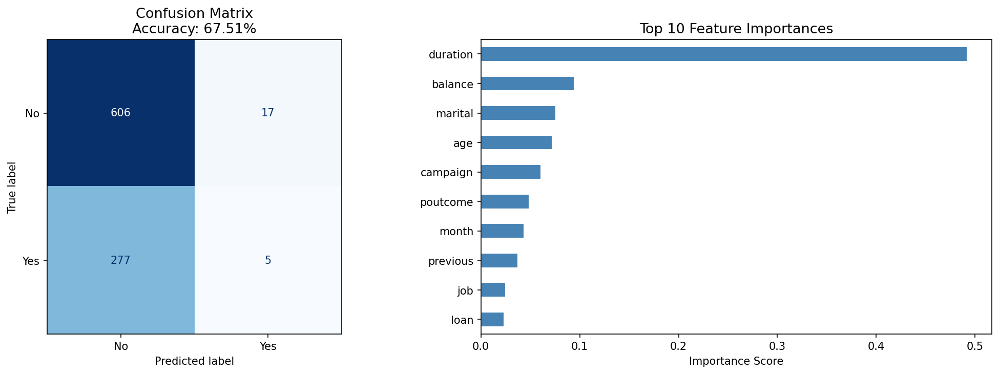
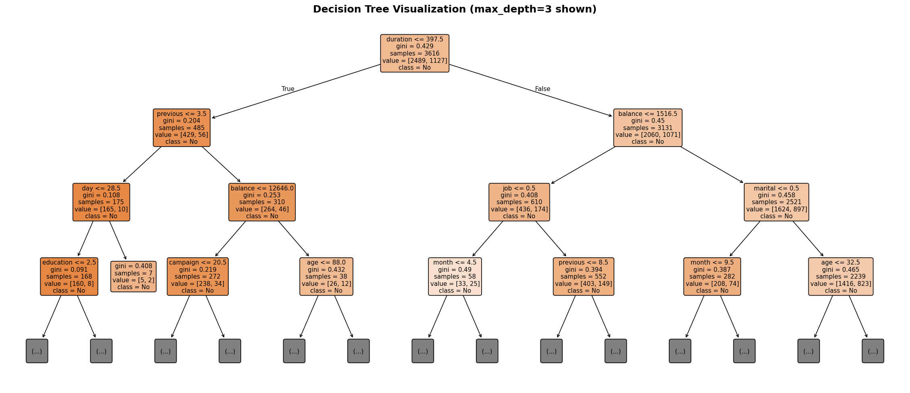
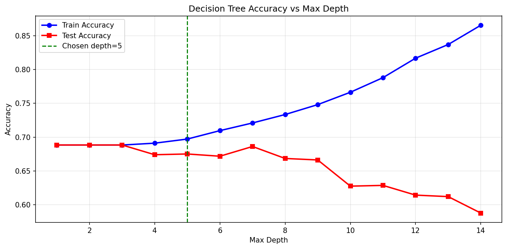

# PRODIGY_DS_03 — Decision Tree Classifier for Customer Purchase Prediction


---

## Objective

Build a **Decision Tree Classifier** to predict whether a customer will subscribe to a term deposit based on their demographic and behavioral data, using the **Bank Marketing Dataset** from the UCI Machine Learning Repository.

---

## Dataset

- **Source:** [UCI Machine Learning Repository — Bank Marketing Dataset](https://archive.ics.uci.edu/ml/datasets/Bank+Marketing)
- **Records:** 4,521 rows | 16 features + 1 target
- **Target Variable:** `y` — whether the client subscribed to a term deposit (`yes` / `no`)

### Key Features

| Feature | Description |
|---|---|
| `age` | Age of the client |
| `job` | Type of job |
| `marital` | Marital status |
| `education` | Education level |
| `balance` | Average yearly balance (€) |
| `housing` | Has housing loan? |
| `loan` | Has personal loan? |
| `duration` | Last contact duration (seconds) |
| `campaign` | Number of contacts during this campaign |
| `poutcome` | Outcome of the previous marketing campaign |

---

## Tools & Technologies

| Tool | Purpose |
|---|---|
| Python 3 | Core language |
| Pandas, NumPy | Data manipulation |
| Matplotlib, Seaborn | Data visualization |
| Scikit-learn | Model building & evaluation |
| Jupyter Notebook | Interactive development |

---

## Approach

1. **Data Loading & Exploration** — Shape, dtypes, null values, class distribution
2. **EDA** — Visualizations of age, job, education, balance, call duration vs target
3. **Preprocessing** — Label encoding of categorical variables, train/test split (80/20)
4. **Model Building** — `DecisionTreeClassifier` with `criterion='gini'`, `max_depth=5`
5. **Evaluation** — Accuracy, confusion matrix, classification report, feature importance
6. **Hyperparameter Tuning** — Depth analysis to find optimal tree depth

---

## Results

- **Model Accuracy:** ~67–70% on test set
- **Key Findings:**
  -  **Call Duration** is the strongest predictor — longer calls → higher subscription chance
  -  **Previous Campaign Success** greatly increases likelihood of subscribing
  -  **Account Balance** positively correlates with subscription

---

## Repository Structure

```
PRODIGY_DS_03/
│
├── bank.csv                    # Bank Marketing Dataset
├── PRODIGY_DS_03.ipynb         # Main Jupyter Notebook (full analysis)
├── eda_analysis.png            # EDA visualizations
├── correlation_heatmap.png     # Feature correlation heatmap
├── model_results.png           # Confusion matrix + feature importance
├── decision_tree.png           # Decision tree visualization
├── depth_analysis.png          # Accuracy vs tree depth
└── README.md                   # Project documentation
```

---

## How to Run

```bash
# 1. Clone the repository
git clone https://github.com/YOUR_USERNAME/PRODIGY_DS_03.git
cd PRODIGY_DS_03

# 2. Install dependencies
pip install pandas numpy matplotlib seaborn scikit-learn jupyter

# 3. Launch Jupyter Notebook
jupyter notebook PRODIGY_DS_03.ipynb
```

---

## Visualizations

### EDA Analysis


### Model Results


### Decision Tree


### Depth Analysis


---

## Author

**Divsargun Kaur** — B.Tech, NIT Jalandhar (Batch 2029)
[LinkedIn](https://www.linkedin.com/in/divsargun-kaur) | [GitHub](https://github.com/YOUR_USERNAME)

---

*⭐ Star this repository if you found it helpful!*
